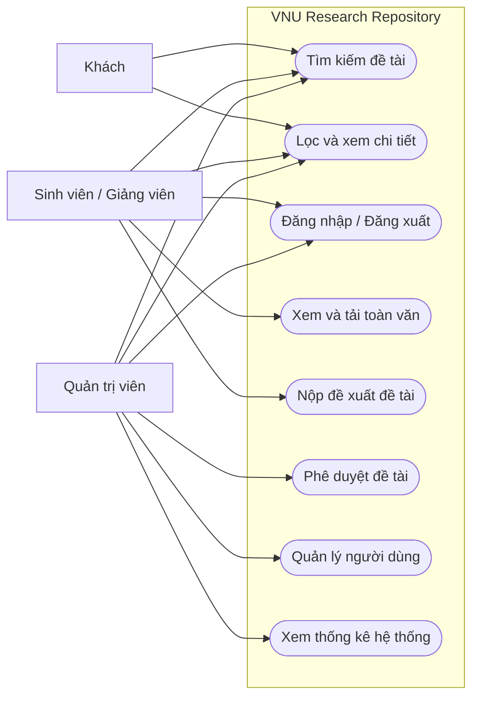
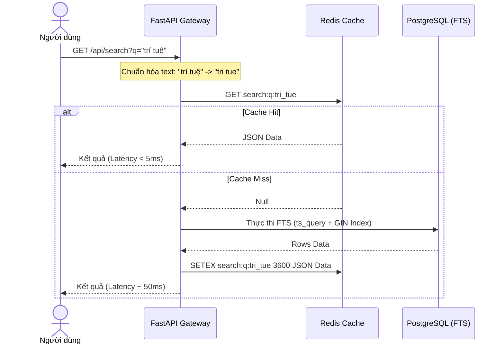
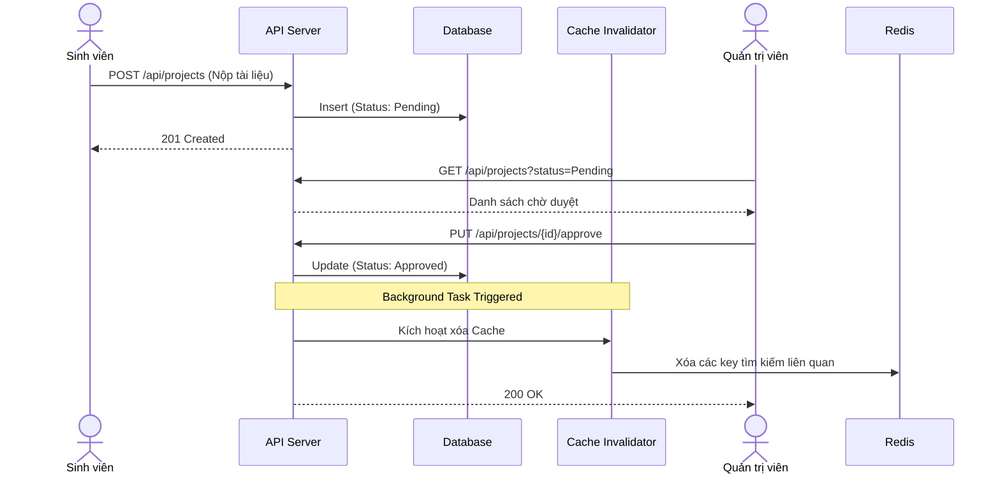
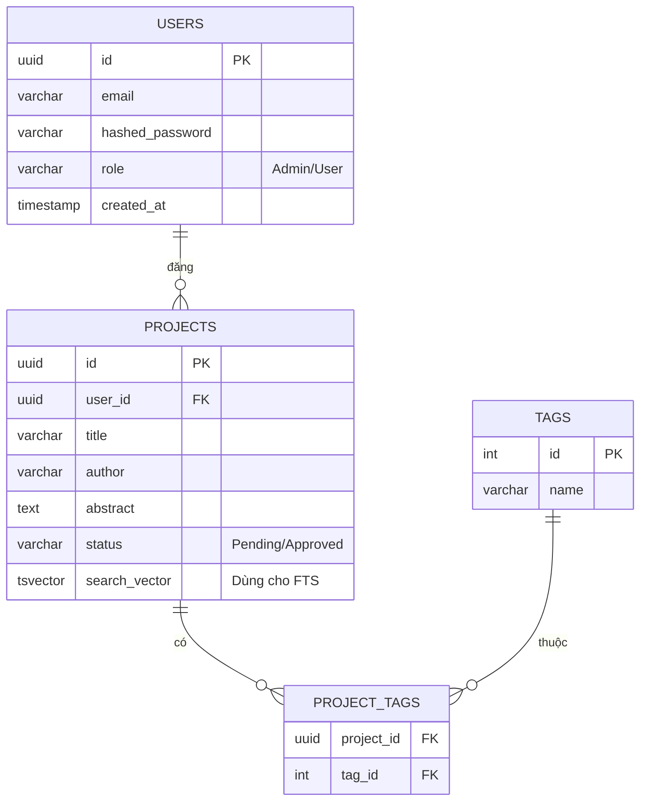
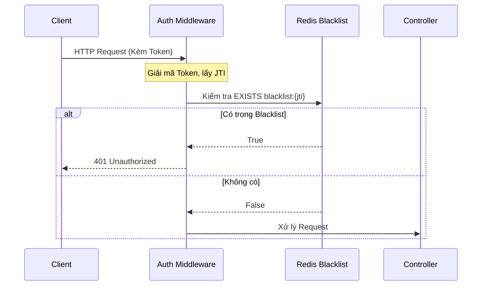

# BÁO CÁO PHÂN TÍCH VÀ THIẾT KẾ HỆ THỐNG
**Dự án: VNU Research Repository (Enterprise Edition)**

---

## Danh mục từ viết tắt
- **API**: Application Programming Interface
- **FTS**: Full-Text Search (Tìm kiếm toàn văn)
- **JWT**: JSON Web Token
- **SOA**: Service-Oriented Architecture (Kiến trúc hướng dịch vụ)
- **RBAC**: Role-Based Access Control (Kiểm soát truy cập dựa trên vai trò)
- **ERD**: Entity-Relationship Diagram (Sơ đồ thực thể liên kết)
- **RPS**: Requests Per Second

---

## 1. Giới thiệu đề tài

### 1.1 Bối cảnh
Trong kỷ nguyên số hóa, số lượng đề tài nghiên cứu khoa học (NCKH), khóa luận, luận văn tại VNU gia tăng nhanh chóng. Tuy nhiên, dữ liệu hiện đang bị phân tán ở nhiều khoa/viện khác nhau, chưa có một kho lưu trữ số hóa tập trung (Centralized Repository) đủ mạnh để phục vụ nhu cầu tra cứu tốc độ cao của hàng ngàn sinh viên và giảng viên cùng lúc.

### 1.2 Lý do chọn đề tài
Hệ thống tra cứu cũ sử dụng các câu lệnh truy vấn cơ sở dữ liệu truyền thống (`LIKE '%keyword%'`) dẫn đến hiệu năng cực kỳ chậm khi dữ liệu phình to. Hơn nữa, kiến trúc nguyên khối (Monolith) cũ không có khả năng mở rộng (scale) trong các dịp cao điểm. Dự án này được chọn để tái cấu trúc lại toàn bộ hệ thống lõi (Backend) đạt chuẩn Enterprise Production.

### 1.3 Mục tiêu đề tài
**1.3.1 Mục tiêu tổng quát**
Xây dựng một hệ thống Web API phục vụ lưu trữ và tra cứu đề tài NCKH tập trung, tốc độ cao, hỗ trợ tìm kiếm thông minh và đảm bảo tính mở rộng, bảo mật.

**1.3.2 Mục tiêu cụ thể**
- Tốc độ truy vấn tìm kiếm (Search Latency) dưới 100ms.
- Hỗ trợ tìm kiếm mờ (Fuzzy Search), sửa lỗi chính tả.
- Áp dụng cơ chế Distributed Cache (Redis).
- Đảm bảo tính khả dụng cao (99.9% Uptime) thông qua Container hóa (Docker).

### 1.4 Phạm vi hệ thống
Hệ thống bao gồm các phân hệ chính:
1. Cổng tra cứu dành cho người dùng cuối.
2. Hệ thống quản trị (Admin).
3. Hệ thống API Backend giao tiếp.
4. Cơ sở hạ tầng lưu trữ và giám sát.

### 1.5 Phương pháp thực hiện
Áp dụng mô hình Agile, phát triển vòng lặp. Tái cấu trúc qua 4 giai đoạn (Phases) từ Prototype lên Enterprise.

### 1.6 Cấu trúc báo cáo
Báo cáo gồm 6 chương:
1. Giới thiệu đề tài.
2. Khảo sát và phân tích yêu cầu.
3. Phân tích hệ thống.
4. Thiết kế hệ thống.
5. Kiểm thử và đánh giá.
6. Kết luận và hướng phát triển.

---

## 2. Khảo sát và phân tích yêu cầu

### 2.1 Mô tả bài toán
Hệ thống cần quản lý vòng đời của một đề tài NCKH từ lúc được nộp, chờ phê duyệt, cho đến khi được công bố công khai. Sau khi công bố, hệ thống phải cung cấp công cụ tra cứu siêu tốc cho người dùng dựa trên tiêu đề, tác giả, tóm tắt.

### 2.2 Các tác nhân của hệ thống
- **Khách (Guest):** Người dùng chưa đăng nhập.
- **Sinh viên / Giảng viên (User):** Người dùng đã xác thực.
- **Quản trị viên (Admin):** Người quản lý toàn quyền.

### 2.3 Yêu cầu chức năng
**2.3.1 Yêu cầu chức năng tổng quát**
Hệ thống phải cho phép tìm kiếm, lọc dữ liệu, xem chi tiết, quản lý tài khoản và phê duyệt tài liệu.

**2.3.2 Yêu cầu chức năng theo module**
- **Module Tìm kiếm:** Hỗ trợ FTS, synonym, ranking.
- **Module Tài khoản:** Đăng nhập, đăng xuất (có thu hồi token).
- **Module Quản trị:** CRUD đề tài, quản lý người dùng, xem thống kê.

### 2.4 Các use case chính
- UC01: Tìm kiếm đề tài
- UC02: Lọc và xem chi tiết
- UC03: Đăng nhập/Đăng xuất
- UC04: Tải toàn văn
- UC05: Nộp đề tài mới
- UC06: Phê duyệt đề tài
- UC07: Quản lý người dùng

### 2.5 Sơ đồ use case tổng quát



### 2.6 Đặc tả một số use case quan trọng
**(Giản lược để tập trung vào sơ đồ)**
- **UC01 (Tìm kiếm):** Người dùng nhập từ khóa, hệ thống chuẩn hóa, gọi Cache, nếu Miss thì gọi FTS DB.
- **UC03 (Đăng nhập):** Gửi credentials, hệ thống trả về Access Token (15p) và Refresh Token (7 ngày).
- **UC06 (Phê duyệt):** Admin xem danh sách Pending, đổi trạng thái sang Approved. Hệ thống trigger xóa cache cũ.

---

## 3. Phân tích hệ thống

### 3.1 Phân rã chức năng
- **Hệ thống**
  - **Quản lý danh mục:** Từ khóa, lĩnh vực.
  - **Tìm kiếm:** FTS, Fuzzy, Lọc.
  - **Xác thực:** Đăng nhập, Cấp token, Thu hồi token (Blacklist).
  - **Vận hành:** Export metrics (Prometheus).

### 3.2 Phân tích theo module
Tập trung vào 4 module lõi: Auth, Search, Caching, Observability.

### 3.3 Luồng nghiệp vụ chính

**3.3.1 Luồng tìm kiếm (Search Flow)**



**3.3.2 Luồng Đăng và Phê duyệt tài liệu**



### 3.4 Đầu vào, đầu ra và kho dữ liệu
- **Đầu vào:** Search Queries, File PDF, User Credentials.
- **Đầu ra:** JSON responses, File Stream (PDF).
- **Kho dữ liệu:** PostgreSQL (Persistent), Redis (Ephemeral/Cache).

### 3.5 Các ràng buộc nghiệp vụ
- Tốc độ response < 100ms.
- Phải thu hồi Token ngay khi Logout (không đợi hết hạn).
- Giới hạn request (Rate limiting): 100 req/min/user.

---

## 4. Thiết kế hệ thống

### 4.1 Kiến trúc tổng thể

```mermaid
graph TD
    Client[Client (React/Vite)] -->|HTTPS| Proxy[Nginx Load Balancer]
    Proxy --> API[FastAPI Application]
    
    subgraph Core Backend
        API <-->|Check/Set Cache| Redis[(Redis Cache)]
        API <-->|Query Data| DB[(PostgreSQL)]
    end
    
    subgraph Observability
        API -->|Expose /metrics| Prom[Prometheus]
        Prom --> Grafana[Grafana Dashboard]
    end
```

### 4.2 Công nghệ sử dụng
- **Backend:** Python, FastAPI.
- **Database:** PostgreSQL (tận dụng TSVECTOR cho FTS).
- **Cache:** Redis.
- **DevOps:** Docker, Docker Compose.

### 4.3 Thiết kế kiến trúc backend
Sử dụng kiến trúc Controller - Service - Repository phân tách rõ ràng (Clean Architecture cơ bản).

### 4.4 Thiết kế module chức năng
(Đã trình bày chi tiết ở file HTML: Token Blacklist, FTS Engine, Smart Rate Limiting).

### 4.5 Thiết kế cơ sở dữ liệu

**4.5.1 Tổng quan mô hình dữ liệu**
Dữ liệu chuẩn hóa dạng quan hệ. Bảng `projects` chứa cột đặc biệt `search_vector` tự động generate.

**4.5.2 Sơ đồ ERD**



**4.5.3 Thiết kế Indexing (Quan trọng)**
- **B-Tree Index:** Trên các trường `status`, `created_at`.
- **GIN Index:** Trên trường `search_vector` để giảm độ phức tạp tìm kiếm từ O(N) xuống O(log N).
- **GIN Trigram:** Trên `title` để hỗ trợ tìm kiếm mờ (Fuzzy Search).

### 4.6 Thiết kế API
**RESTful endpoints:**
- `GET /api/v1/projects`: Lấy danh sách, phân trang.
- `GET /api/v1/search`: Endpoint tìm kiếm sử dụng FTS.
- `POST /api/v1/auth/login`: Lấy Dual-Token.
- `POST /api/v1/auth/logout`: Thêm JTI vào Blacklist.

### 4.7 Thiết kế bảo mật

**Luồng thu hồi quyền (Logout / Revocation)**


### 4.8 Thiết kế triển khai
Sử dụng `docker-compose.yml` để định nghĩa các services (`api`, `db`, `redis`, `prometheus`, `grafana`). Có healthcheck để tự động restart container nếu bị treo.

---

## 5. Kiểm thử và đánh giá

### 5.1 Chiến lược kiểm thử
- **Unit Test:** Kiểm thử các hàm xử lý logic (ví dụ hàm chuẩn hóa chuỗi).
- **Integration Test:** Kiểm thử luồng API + Database (ví dụ: API Search trả về đúng data).

### 5.2 Đánh giá kết quả
- **Hiệu năng:** Tốc độ tìm kiếm trung bình giảm từ >500ms xuống <50ms nhờ GIN Index và Redis Cache.
- **Bảo mật:** Cơ chế Blacklist hoạt động ổn định, ngăn chặn hoàn toàn việc sử dụng lại token cũ.

---

## 6. Kết luận và hướng phát triển

### 6.1 Kết luận
Dự án đã giải quyết thành công bài toán hiệu năng và kiến trúc, lột xác thành một hệ thống Enterprise Production thực thụ với tốc độ siêu tốc và khả năng chịu tải tốt.

### 6.2 Hướng phát triển
1. Ứng dụng AI/NLP (ví dụ: BERT) để đề xuất đề tài liên quan thay vì chỉ tìm theo từ khóa.
2. Nâng cấp lên Kubernetes (K8S) để tự động scale số lượng container backend theo tải thực tế.

---

## Phụ lục A: Tóm tắt API theo nhóm
- **Auth:** `/login`, `/logout`, `/refresh`
- **Projects:** `/projects` (GET, POST, PUT, DELETE)
- **Search:** `/search?q=...&page=...`
