# DANH SÁCH CÁC SƠ ĐỒ BỔ SUNG
*(Bạn copy từng block mã dưới đây để paste vào các chương tương ứng)*

---
## CHƯƠNG 2

### Hình 2.2: Sơ đồ use case cho phân hệ Tra cứu và Khai thác
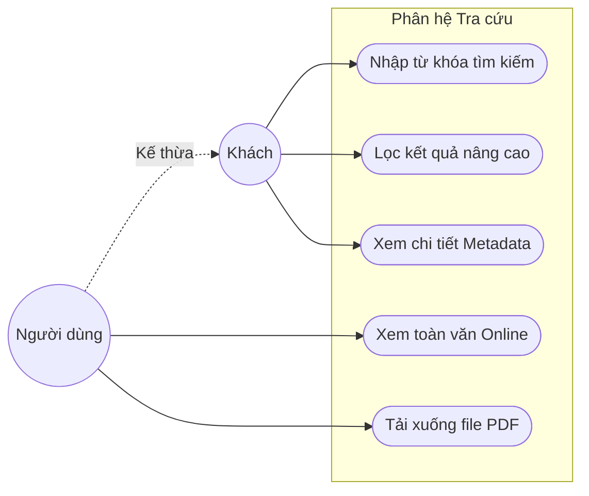

### Hình 2.3: Sơ đồ use case cho phân hệ Quản lý Đề tài
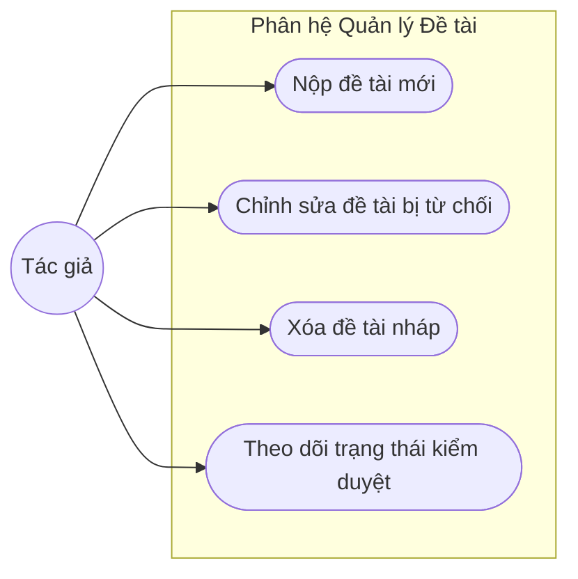

### Hình 2.4: Sơ đồ use case cho phân hệ Quản trị hệ thống
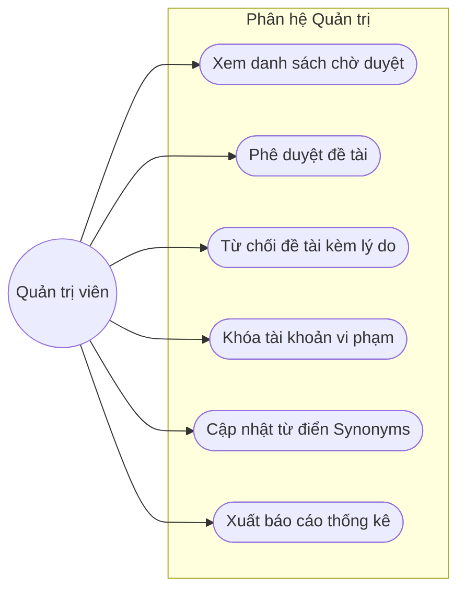

---
## CHƯƠNG 3

### Hình 3.4: Biểu đồ hoạt động (Activity Diagram) luồng Đăng và duyệt bài
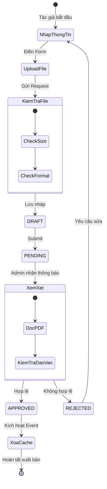

### Hình 3.2: Biểu đồ hoạt động (Activity Diagram) luồng Tìm kiếm
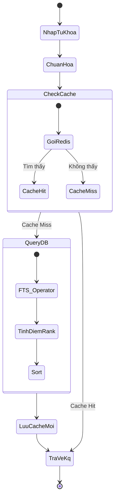

### Hình 3.6: Biểu đồ hoạt động luồng Quản trị và phân quyền
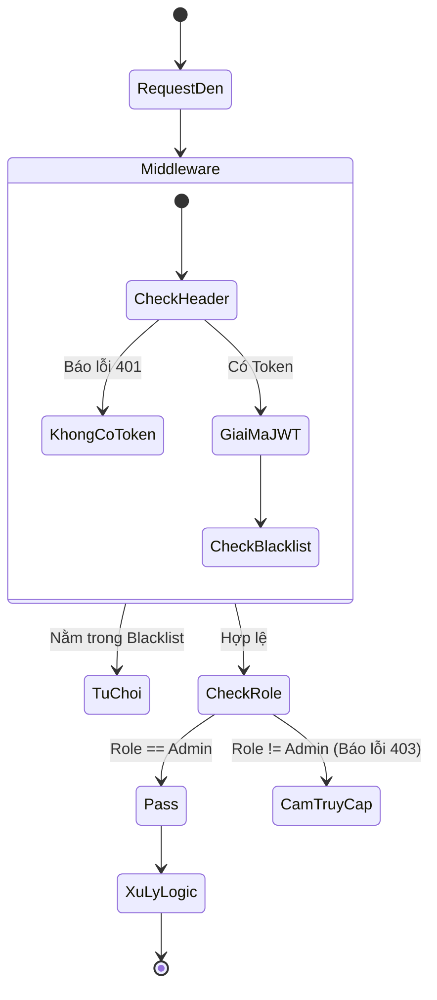

---
## CHƯƠNG 4

### Hình 4.2: Luồng tương tác giữa Frontend, Backend và Hạ tầng
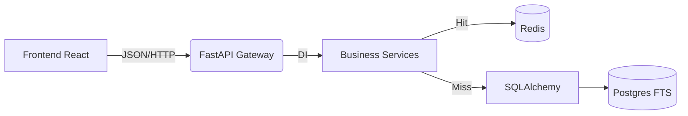

### Hình 4.3: Sơ đồ Package (Clean Architecture)
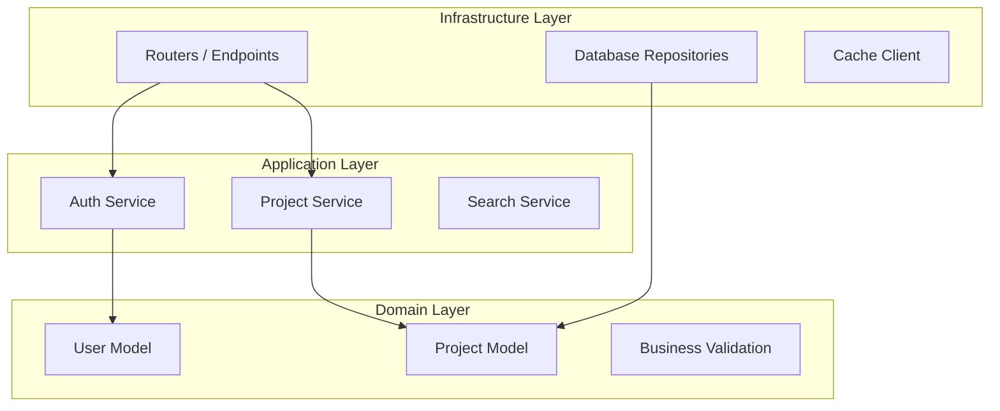

### Hình 4.4: Sơ đồ Component Backend theo các module nghiệp vụ
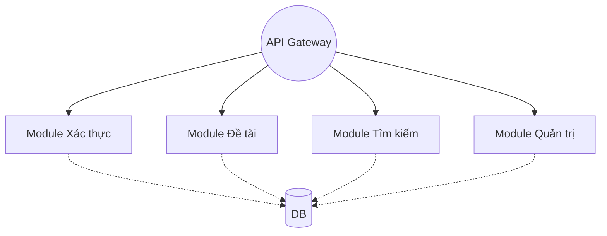

### Hình 4.6: Sequence diagram cho luồng Refresh Token
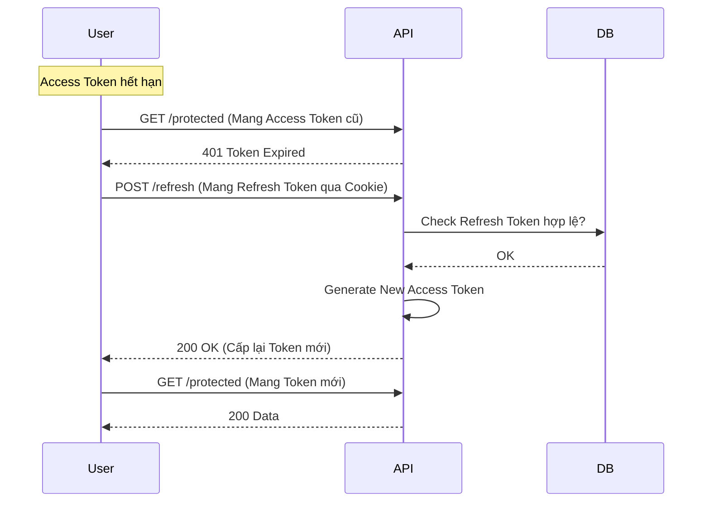

### Hình 4.7: Component diagram cho module Tìm kiếm khoa học
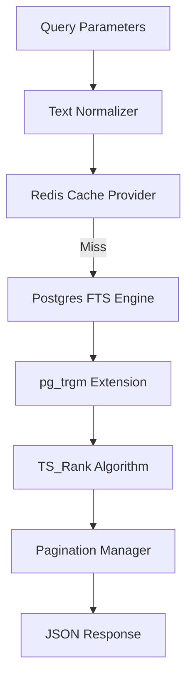

### Hình 4.9: Sơ đồ luồng lưu trữ tệp
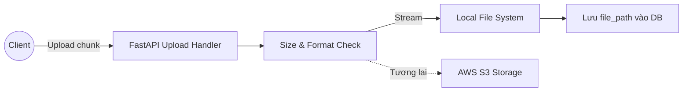

### Hình 4.10: Mô hình dữ liệu logic rút gọn
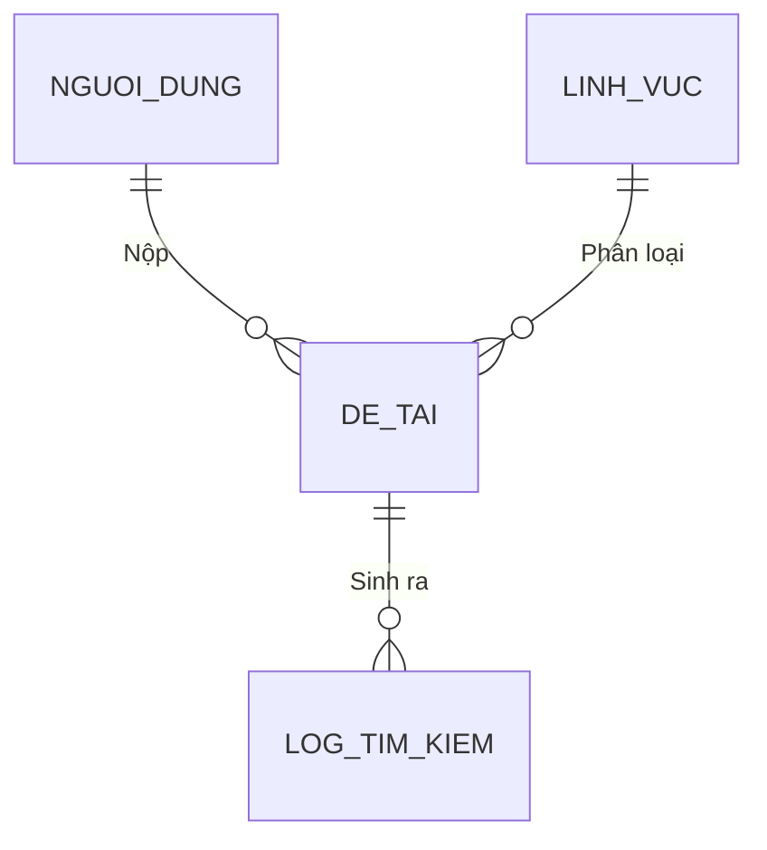

### Hình 4.12: Sơ đồ phân nhóm API theo module
```mermaid
graph TD
    API[Root: /api/v1]
    API --> Auth[/auth]
    API --> Projects[/projects]
    API --> Search[/search]
    API --> Admin[/admin]
    
    Auth --> L1[POST /login]
    Auth --> L2[POST /logout]
    
    Projects --> P1[GET /]
    Projects --> P2[POST /]
    
    Search --> S1[GET /?q=]
```

### Hình 4.13: Sơ đồ bảo mật nhiều tầng
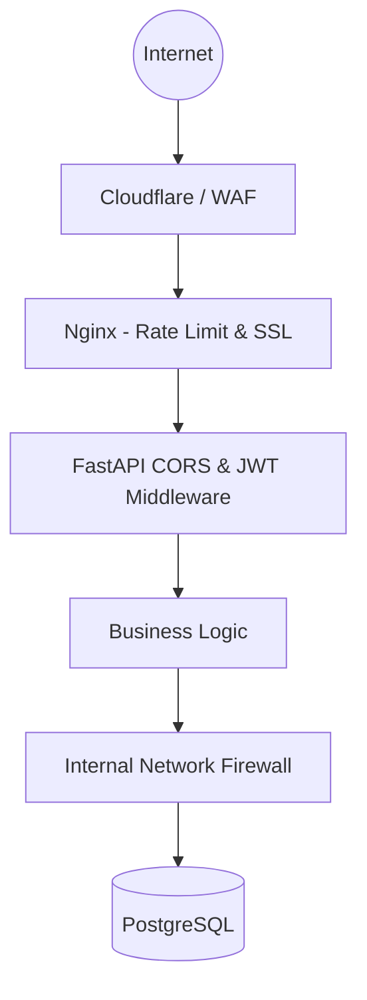

### Hình 4.14: Sơ đồ triển khai Local bằng Docker Compose
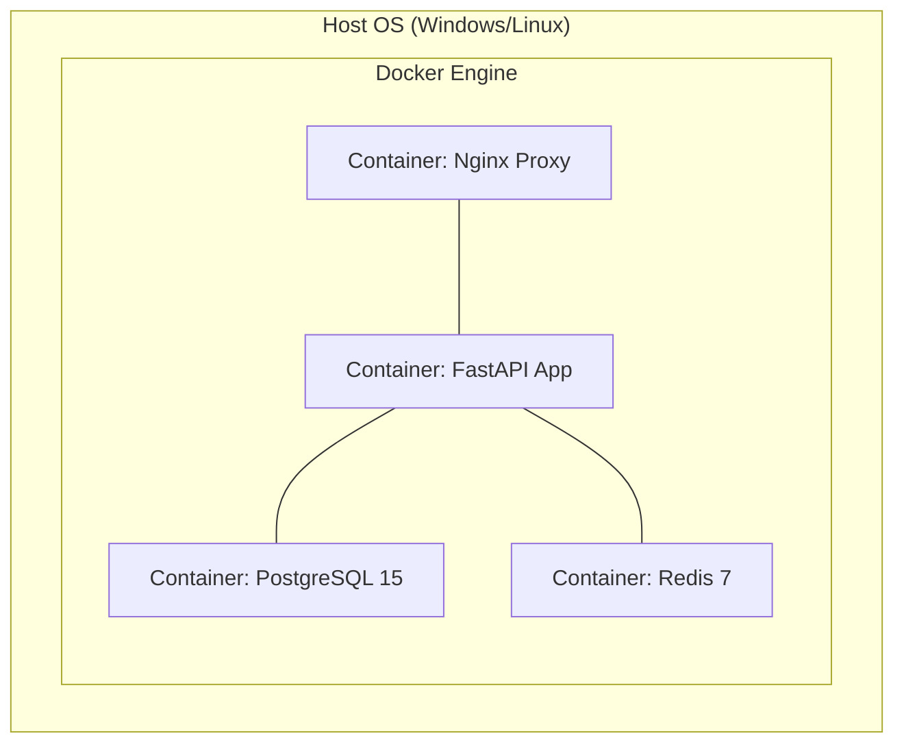

### Hình 4.15: Sơ đồ triển khai Production đề xuất
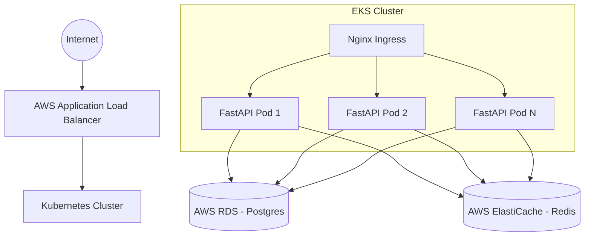

### Hình 4.16: Cấu trúc thư mục Code Backend
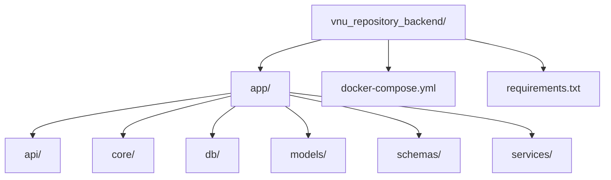
