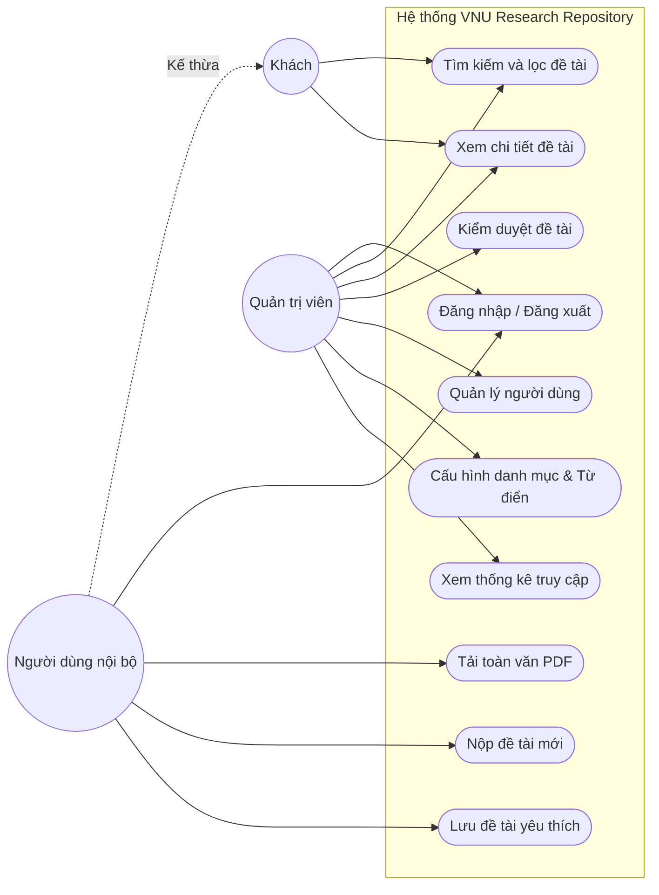

2.5 Sơ đồ Use Case tổng quát
Sơ đồ Use Case (Use Case Diagram) biểu diễn trực quan các chức năng mà hệ thống cung cấp và cách thức các tác nhân (Actors) tương tác với những chức năng đó. Sơ đồ dưới đây cung cấp cái nhìn toàn cảnh về hệ thống VNU Research Repository.

Để làm rõ hơn nghiệp vụ của từng mảng, hệ thống được chia nhỏ thành các phân hệ Use Case sau:

2.5.1 Sơ đồ Use Case Phân hệ Tra cứu và Khai thác
Phân hệ này tập trung vào các chức năng cốt lõi nhất của một kho lưu trữ số: giúp người dùng tìm thấy dữ liệu họ cần.
- Tác nhân tham gia: Khách, Người dùng nội bộ.
- Chức năng chính: Tìm kiếm từ khóa (có hỗ trợ Fuzzy Search), Lọc theo Face Filtering (Năm, Tác giả, Lĩnh vực), Xem thông tin Metadata, và Tải file toàn văn (chỉ dành cho Người dùng nội bộ).

2.5.2 Sơ đồ Use Case Phân hệ Quản lý Đề tài (Dành cho Tác giả)
Phân hệ này phục vụ quá trình đóng góp nội dung vào kho lưu trữ.
- Tác nhân tham gia: Người dùng nội bộ (vai trò Tác giả).
- Chức năng chính: Tạo mới hồ sơ đề tài, tải lên file đính kèm, cập nhật thông tin khi đề tài bị từ chối yêu cầu sửa đổi, theo dõi trạng thái đề tài (Pending/Approved/Rejected).

2.5.3 Sơ đồ Use Case Phân hệ Quản trị Hệ thống
Phân hệ này dành riêng cho những người vận hành hệ thống.
- Tác nhân tham gia: Quản trị viên (Admin).
- Chức năng chính: Phê duyệt đề tài (Workflow duyệt bài), Thêm/Sửa/Xóa tài khoản người dùng, Quản lý bộ từ điển đồng nghĩa (Synonyms) cho Search Engine, Xem biểu đồ theo dõi sức khỏe hệ thống và lưu lượng truy cập.

---

2.6 Đặc tả một số Use Case quan trọng

Để việc triển khai kỹ thuật (code) sau này bám sát yêu cầu nghiệp vụ, các Use Case cốt lõi nhất được đặc tả chi tiết thông qua các kịch bản (Flows).

2.6.1 Use Case: Tìm kiếm và lọc đề tài (Search & Filter)
- Mã UC: UC-01
- Tác nhân: Khách, Người dùng nội bộ, Quản trị viên.
- Mô tả tóm tắt: Cho phép người dùng nhập từ khóa và/hoặc chọn các tiêu chí lọc để tìm các đề tài nghiên cứu phù hợp trong cơ sở dữ liệu.
- Tiền điều kiện: Không có (Hệ thống đang hoạt động bình thường).
- Hậu điều kiện: Trả về danh sách các đề tài khớp với tiêu chí, được phân trang và sắp xếp theo độ liên quan (Relevance).

* Luồng sự kiện chính (Main Flow):
  1. Người dùng truy cập trang chủ của hệ thống.
  2. Người dùng nhập từ khóa vào thanh tìm kiếm (ví dụ: "công nghệ AI") và nhấn nút "Tìm kiếm".
  3. Hệ thống gửi Request chứa từ khóa xuống Backend API.
  4. Backend chuẩn hóa từ khóa (loại bỏ khoảng trắng thừa, đưa về chữ thường).
  5. Backend kiểm tra từ khóa trong bộ đệm Redis Cache.
  6. (Trường hợp Cache Miss): Backend tiếp tục gọi cơ sở dữ liệu PostgreSQL, sử dụng tính năng Full-Text Search (Toán tử @@) kết hợp Trigram Index để tìm kiếm.
  7. Cơ sở dữ liệu tính toán điểm số (Rank) và trả về danh sách kết quả (20 kết quả đầu tiên).
  8. Backend lưu danh sách này vào Redis Cache với thời gian sống (TTL) là 1 giờ.
  9. Hệ thống hiển thị danh sách kết quả lên màn hình cho người dùng, bao gồm: Tiêu đề, Tác giả, Năm công bố, và một đoạn trích ngắn có bôi đậm từ khóa (Highlight).

* Luồng sự kiện ngoại lệ (Alternative Flows):
  - Ngoại lệ 1 (Không tìm thấy kết quả): Ở bước 7, CSDL không tìm thấy kết quả nào. Hệ thống chuyển sang bước 9, hiển thị thông báo "Không tìm thấy đề tài nào phù hợp với từ khóa: [từ khóa]". Gợi ý người dùng thử lại bằng từ khóa khác hoặc xóa bớt bộ lọc. Đồng thời Backend ghi nhận từ khóa này vào Log "Zero-result" để Admin phân tích.
  - Ngoại lệ 2 (Lỗi kết nối CSDL): Ở bước 6, nếu kết nối tới DB bị đứt, Backend trả về HTTP 500. Màn hình hiển thị thông báo lỗi "Hệ thống đang bảo trì, vui lòng thử lại sau".

2.6.2 Use Case: Đăng nhập hệ thống (Authentication)
- Mã UC: UC-02
- Tác nhân: Người dùng nội bộ, Quản trị viên.
- Mô tả tóm tắt: Xác thực danh tính người dùng để cấp quyền truy cập vào các chức năng nâng cao (như tải file, nộp bài).
- Tiền điều kiện: Người dùng đã được cấp tài khoản hợp lệ.
- Hậu điều kiện: Người dùng được cấp cặp thẻ chứng nhận (Access Token và Refresh Token) và được chuyển hướng vào trang Dashboard.

* Luồng sự kiện chính (Main Flow):
  1. Người dùng bấm vào nút "Đăng nhập" và điền Email, Mật khẩu.
  2. Hệ thống gửi thông tin định danh xuống Backend.
  3. Backend băm (Hash) mật khẩu người dùng vừa nhập bằng thuật toán bcrypt.
  4. Backend so sánh mã băm này với mã băm lưu trong cơ sở dữ liệu.
  5. Nếu khớp, Backend tiến hành khởi tạo JSON Web Token (JWT).
  6. Backend sinh ra Access Token (thời hạn 15 phút) và Refresh Token (thời hạn 7 ngày).
  7. Backend gửi trả cặp Token này về cho Client.
  8. Hệ thống lưu Access Token vào Local Storage (hoặc Memory) và Refresh Token vào HTTPOnly Cookie, sau đó chuyển hướng người dùng vào hệ thống.

* Luồng sự kiện ngoại lệ:
  - Ngoại lệ 1 (Sai mật khẩu): Ở bước 4, mã băm không khớp. Hệ thống trả về lỗi "Tài khoản hoặc mật khẩu không chính xác". Số lần đăng nhập sai của tài khoản đó bị cộng thêm 1.
  - Ngoại lệ 2 (Khóa tài khoản): Ở bước 2, Backend kiểm tra thấy cờ (flag) `is_active = false` hoặc số lần nhập sai quá 5 lần. Hệ thống từ chối đăng nhập và báo "Tài khoản của bạn đã bị khóa tạm thời vì lý do bảo mật".

2.6.3 Use Case: Nộp đề tài nghiên cứu mới (Submit Project)
- Mã UC: UC-03
- Tác nhân: Người dùng nội bộ (Vai trò Tác giả).
- Mô tả tóm tắt: Tác giả tải lên thông tin và file nội dung của một công trình nghiên cứu mới để chờ thư viện kiểm duyệt.
- Tiền điều kiện: Người dùng đã đăng nhập.
- Hậu điều kiện: Một bản ghi mới được tạo trong DB với trạng thái "Pending" (Chờ duyệt), Admin nhận được thông báo.

* Luồng sự kiện chính:
  1. Tác giả chọn chức năng "Nộp đề tài mới".
  2. Hệ thống hiển thị biểu mẫu (Form) điền thông tin: Tiêu đề, Tác giả phụ, Lĩnh vực, Tóm tắt, và ô tải file đính kèm (PDF).
  3. Tác giả điền đầy đủ thông tin bắt buộc và chọn file PDF từ máy tính, sau đó nhấn "Gửi phê duyệt".
  4. Frontend kiểm tra định dạng file (phải là .pdf) và dung lượng file (dưới 50MB).
  5. Nếu hợp lệ, hệ thống gọi API Upload.
  6. Backend lưu file vào hệ thống lưu trữ vật lý (hoặc S3) và lưu đường dẫn kèm metadata vào bảng `projects` trong CSDL với trạng thái `status = 'PENDING'`.
  7. Backend kích hoạt một sự kiện gửi thông báo (qua Email/Web) cho toàn bộ Quản trị viên.
  8. Hệ thống hiển thị thông báo thành công cho Tác giả.

* Luồng sự kiện ngoại lệ:
  - Ngoại lệ 1 (File không hợp lệ): Ở bước 4, nếu file không phải PDF hoặc vượt quá 50MB, hệ thống chặn việc gọi API và báo lỗi trực tiếp trên giao diện "Chỉ chấp nhận file PDF và dung lượng tối đa 50MB".
  - Ngoại lệ 2 (Thiếu thông tin bắt buộc): Ở bước 3, tác giả để trống phần Tiêu đề. Nút "Gửi phê duyệt" bị làm mờ (Disabled) cho đến khi nhập đủ.

2.6.4 Use Case: Phê duyệt đề tài (Approve Project)
- Mã UC: UC-04
- Tác nhân: Quản trị viên (Admin).
- Mô tả tóm tắt: Quản trị viên xem xét nội dung đề tài được nộp lên và ra quyết định cho phép hiển thị công khai hay không. Quá trình này đặc biệt quan trọng vì nó liên quan đến việc cập nhật bộ nhớ đệm (Cache).
- Tiền điều kiện: Admin đã đăng nhập. Có ít nhất 1 đề tài ở trạng thái "Pending".
- Hậu điều kiện: Đề tài chuyển sang trạng thái "Approved" (Hiển thị công khai) hoặc "Rejected" (Trả về cho tác giả).

* Luồng sự kiện chính (Main Flow - Trường hợp Duyệt):
  1. Admin truy cập trang "Quản lý chờ duyệt", hệ thống hiển thị danh sách các đề tài có trạng thái "Pending".
  2. Admin bấm xem chi tiết một đề tài và đọc file PDF đính kèm.
  3. Admin nhận thấy tài liệu hợp lệ, nhấn nút "Phê duyệt" (Approve).
  4. Hệ thống gửi Request mang ID của đề tài xuống Backend.
  5. Backend thực thi lệnh UPDATE trong CSDL, chuyển `status = 'APPROVED'`. Cột `search_vector` tự động được Database tính toán lại dựa trên tiêu đề và tóm tắt.
  6. (Bước quan trọng - Data Consistency): Backend gọi một Background Task để truy cập vào Redis Cache, tiến hành quét (SCAN) và Xóa (DEL) toàn bộ các khóa (Keys) tìm kiếm hiện có để tránh việc người dùng tìm kiếm ra kết quả cũ.
  7. Backend trả kết quả thành công, hệ thống gửi Email thông báo "Đề tài đã được duyệt" cho Tác giả.

* Luồng sự kiện ngoại lệ:
  - Ngoại lệ 1 (Từ chối duyệt): Ở bước 3, Admin phát hiện tài liệu vi phạm thể thức hoặc đạo văn. Admin nhấn "Từ chối" (Reject). Hệ thống yêu cầu Admin nhập một đoạn text lý do. Trạng thái đề tài cập nhật thành 'REJECTED' và tác giả nhận được Email yêu cầu chỉnh sửa kèm lý do. (Lưu ý: Không cần xóa Cache ở bước này vì đề tài Pending vốn dĩ chưa từng được đưa lên Cache).
