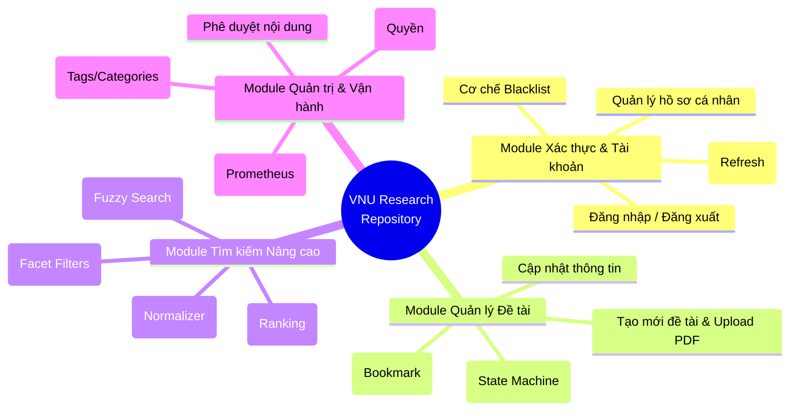
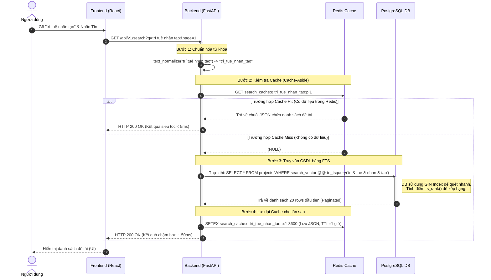

CHƯƠNG 3. PHÂN TÍCH HỆ THỐNG

Sau khi đã hoàn thành bước khảo sát và định hình được các yêu cầu ở Chương 2, chương này sẽ đi sâu vào việc phân tích logic nội tại của hệ thống. Quá trình phân tích bao gồm việc chia cắt hệ thống lớn thành các thành phần nhỏ hơn (Phân rã chức năng) và mô hình hóa các luồng nghiệp vụ cốt lõi (Business Flows) để làm tiền đề cho bước Thiết kế Kiến trúc và CSDL ở chương tiếp theo.

3.1 Phân rã chức năng (Functional Decomposition)
Phương pháp phân rã chức năng (Top-Down) được áp dụng để chia hệ thống VNU Research Repository thành các module độc lập. Việc phân rã này cực kỳ quan trọng vì nó định hình ranh giới (Boundaries) cho các Microservices hoặc các gói (Packages) trong mã nguồn sau này.

3.2 Phân tích theo module
Mỗi module được thiết kế để tuân thủ nguyên tắc Đơn trách nhiệm (Single Responsibility Principle - SRP).

3.2.1 Module Xác thực và Tài khoản (Auth & Identity Module)
- Trách nhiệm: Là "cửa ngõ" bảo vệ toàn bộ hệ thống. Nhiệm vụ duy nhất của module này là xác minh người dùng là ai (Authentication) và họ được phép làm gì (Authorization).
- Logic cốt lõi: Module không lưu trữ trạng thái phiên làm việc trong bộ nhớ (Stateless) mà sử dụng công nghệ JSON Web Token (JWT). Khi cấp phát, nó sinh ra 2 token: Access Token (ngắn hạn) và Refresh Token (dài hạn). Điểm đặc biệt trong phân tích là bài toán "Thu hồi token tức thời" khi người dùng đăng xuất. Để giải quyết, module này phải tương tác chặt chẽ với một bộ nhớ tốc độ cao (Redis) để lưu trữ Danh sách đen (Blacklist).

3.2.2 Module Nghiên cứu khoa học (Research Management Module)
- Trách nhiệm: Xử lý toàn bộ vòng đời của một tài liệu từ lúc được khởi tạo cho đến lúc xuất bản.
- Logic cốt lõi: Áp dụng mô hình Máy trạng thái hữu hạn (Finite State Machine - FSM). Một đề tài sẽ chuyển dịch qua các trạng thái: `DRAFT` (Bản nháp - chỉ tác giả thấy) -> `PENDING` (Chờ duyệt - Admin thấy) -> `APPROVED` (Đã duyệt - Công khai) hoặc `REJECTED` (Từ chối - Tác giả phải sửa). Module này cũng phải xử lý các luồng I/O luồng nặng như việc lưu file PDF an toàn vào hệ thống tệp (File System) hoặc Object Storage (S3).

3.2.3 Module Tìm kiếm Nâng cao (Advanced Search Module)
- Trách nhiệm: Cung cấp kết quả tìm kiếm với độ trễ (Latency) thấp nhất có thể và độ chính xác cao nhất.
- Logic cốt lõi: Đây là module chịu tải cao nhất (Read-heavy). Thay vì truy vấn trực tiếp vào Cơ sở dữ liệu chính, module này áp dụng chiến lược Cache-Aside. Mọi truy vấn sẽ đi qua một lớp chuẩn hóa văn bản (Text Normalizer: bỏ dấu, viết thường, cắt khoảng trắng), sau đó dò tìm trong Cache. Chỉ khi dữ liệu không có trong Cache (Cache Miss), module mới gọi lệnh xuống CSDL sử dụng toán tử Full-Text Search.

3.2.4 Module Quản trị (Admin Module)
- Trách nhiệm: Cung cấp các công cụ vận hành cho Ban quản trị.
- Logic cốt lõi: Yêu cầu cấp quyền khắt khe (Role = Admin). Module này cung cấp các API để can thiệp vào dữ liệu của các module khác (ví dụ: đổi trạng thái đề tài của Module Nghiên cứu, khóa tài khoản của Module Xác thực). Ngoài ra, nó phải thu thập và định dạng dữ liệu thô thành các báo cáo thống kê (Trending keywords, Zero-result keywords) để trả về cho bảng điều khiển Dashboard.

---

3.3 Luồng nghiệp vụ chính (Business Flows)
Việc mô hình hóa các luồng nghiệp vụ giúp các lập trình viên hình dung rõ sự tương tác giữa các thực thể hệ thống (Client, Server, Database, Cache).

3.3.1 Luồng Tìm kiếm và Khai thác dữ liệu (Search Flow)
Đây là luồng nghiệp vụ quan trọng số 1 của dự án, quyết định thành bại của hệ thống Enterprise. Bài toán đặt ra là: Làm sao để truy vấn hàng triệu bản ghi trong dưới 100ms? Giải pháp phân tích chỉ ra việc sử dụng kết hợp Redis (bộ đệm) và PostgreSQL FTS (động cơ tìm kiếm).

Sơ đồ Tuần tự (Sequence Diagram) dưới đây mô tả luồng xử lý:

Phân tích ngoại lệ trong luồng Tìm kiếm:
- Tình huống: Người dùng nhập từ khóa quá ngắn (dưới 2 ký tự) hoặc chứa các ký tự đặc biệt gây nguy hiểm (SQL Injection).
- Xử lý: Tại "Bước 1" trên sơ đồ, Backend API sẽ thực hiện Validation (Kiểm tra tính hợp lệ). Nếu vi phạm, API lập tức chặn lại và ném ra lỗi HTTP 400 Bad Request, không cho phép truy vấn đi xuống Redis hay DB để bảo vệ tài nguyên hệ thống.
- Tình huống: Database bị sập (Down).
- Xử lý: Nếu xảy ra Cache Miss và API cố gọi DB nhưng thất bại (Timeout), hệ thống phải bắt lỗi (Try/Catch) và trả về HTTP 500 Internal Server Error, hiển thị thông báo thân thiện cho người dùng thay vì crash toàn bộ ứng dụng.
