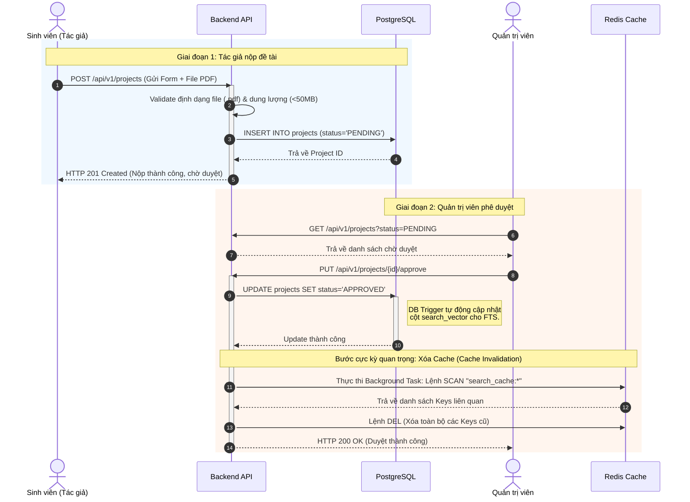
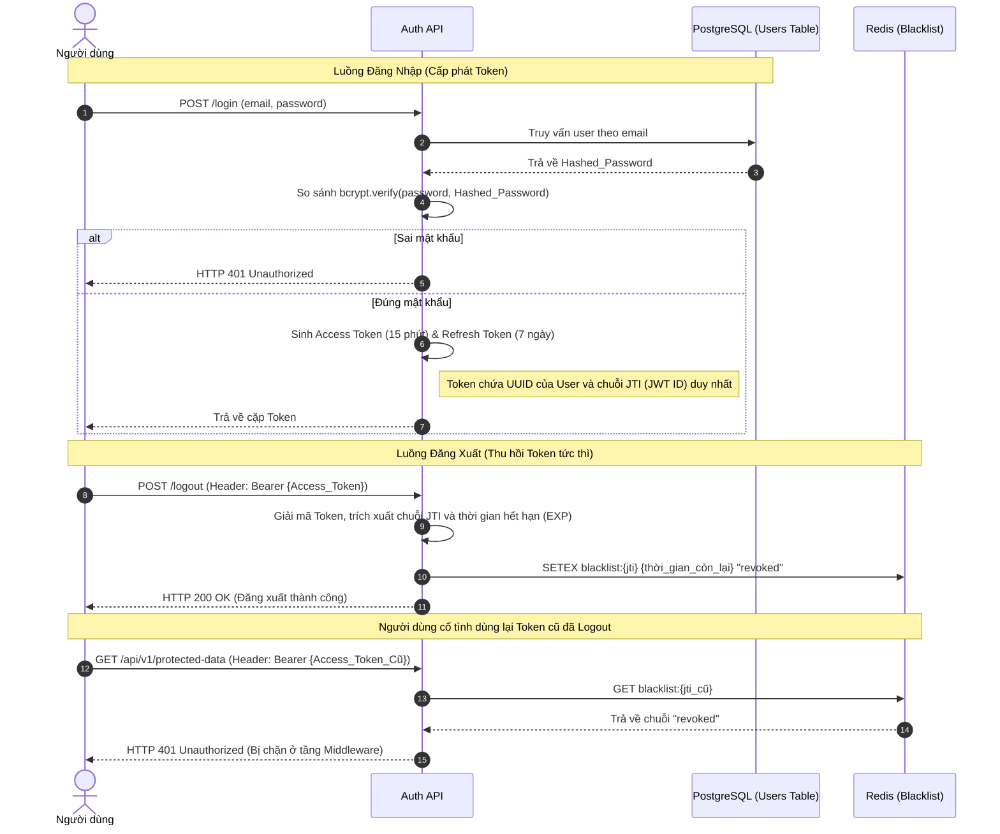

3.3.2 Luồng Đăng tài liệu và Phê duyệt (Publish & Approve Flow)
Luồng nghiệp vụ này liên quan đến 2 tác nhân là Tác giả (Sinh viên/Giảng viên) và Quản trị viên (Admin). Điểm phức tạp nhất của luồng này nằm ở việc duy trì "Tính nhất quán dữ liệu" (Data Consistency). Khi một đề tài mới được Admin phê duyệt (tức là thay đổi trạng thái trong CSDL), hệ thống bắt buộc phải thực hiện xóa (Invalidate) các kết quả tìm kiếm cũ đang nằm trong bộ đệm Redis. Nếu bỏ qua bước này, người dùng sẽ không thể tìm thấy đề tài vừa được duyệt cho đến khi Cache cũ tự hết hạn (có thể mất tới 1 giờ).

Sơ đồ Tuần tự dưới đây mô tả quá trình nộp và duyệt bài khép kín:

Phân tích ngoại lệ:
- Tình huống: Tác giả nộp file vượt quá dung lượng cho phép.
- Xử lý: Frontend sẽ chặn ở phía Client, nhưng Backend cũng phải có lớp phòng thủ thứ hai. API sẽ kiểm tra `Content-Length` trong Header. Nếu > 50MB, lập tức ném lỗi HTTP 413 Payload Too Large và đóng luồng kết nối trước khi tải file vào bộ nhớ (RAM), giúp chống tấn công cạn kiệt tài nguyên.

3.3.3 Luồng Xác thực và Bảo mật (Auth & Security Flow)
Đây là luồng nghiệp vụ bảo vệ hệ thống. Khác với kiến trúc cũ lưu Session ID trong bộ nhớ máy chủ (gây khó khăn khi Scale-out nhiều máy chủ), hệ thống mới sử dụng JSON Web Token (JWT) kết hợp với danh sách đen (Blacklist) lưu trữ tập trung trên Redis.

Sơ đồ Tuần tự dưới đây mô tả quá trình cấp phát và thu hồi Token (Logout):

---

3.4 Đầu vào, đầu ra và kho dữ liệu (I/O & Data Stores)
Mọi luồng dữ liệu di chuyển trong hệ thống đều được kiểm soát chặt chẽ thông qua các mô hình chuẩn.

Bảng 3.1. Ma trận luồng dữ liệu theo Module:

| Module / Phân hệ | Dữ liệu Đầu vào (Inputs) | Dữ liệu Đầu ra (Outputs) | Nơi lưu trữ (Data Store) |
|---|---|---|---|
| **Xác thực (Auth)** | Thông tin đăng nhập (Email, Password), Chuỗi Token cũ cần Refresh. | Cặp chuỗi JWT (Access/Refresh), Thông báo lỗi xác thực. | Bảng `users` (PostgreSQL), Bộ nhớ `Blacklist` (Redis). |
| **Tìm kiếm (Search)** | Chuỗi ký tự (Query parameters: `q`, `page`, `filters`). | Mảng JSON chứa danh sách tóm tắt đề tài, Số lượng trang (Total pages). | Cột `search_vector` trong bảng `projects` (PostgreSQL). |
| **Quản lý Đề tài (Projects)** | Biểu mẫu thông tin (Form Data: Title, Abstract), File nhị phân (.pdf). | Mã định danh đề tài (UUID), File PDF (Stream tải xuống). | Bảng `projects` (PostgreSQL), File System hoặc AWS S3. |
| **Quản trị (Admin)** | Lệnh thay đổi trạng thái (Approve/Reject), Lệnh xóa bộ đệm. | Thông báo trạng thái thực thi, Dữ liệu báo cáo thống kê dạng chuỗi thời gian (Time-series). | Cột `status` (PostgreSQL), Metrics Database (Prometheus). |

---

3.5 Các ràng buộc nghiệp vụ (Business Rules & Constraints)
Để đảm bảo hệ thống vận hành đúng với bối cảnh học thuật của nhà trường và ngăn chặn việc lạm dụng, các ràng buộc (Rules) cứng sau đây được lập trình sâu vào tầng lõi:

1. Ràng buộc về dữ liệu (Data Validation Rules):
- Mật khẩu người dùng: Phải có độ dài tối thiểu 8 ký tự, bao gồm ít nhất một chữ hoa, một chữ số và một ký tự đặc biệt (chống Brute-force).
- Dung lượng file đính kèm: Kích thước tối đa cho mỗi file PDF nghiên cứu là 50MB. Hệ thống không chấp nhận bất kỳ định dạng nào khác (như .doc, .docx) để tránh nguy cơ đính kèm mã độc (Macro virus) và đảm bảo tính đồng nhất khi người dùng tải xuống.

2. Ràng buộc về phiên làm việc (Session Lifecycle):
- Tuổi thọ Access Token (Thời gian sống): Bắt buộc hết hạn sau 15 phút. Người dùng không được phép chỉnh sửa cấu hình này.
- Thu hồi tuyệt đối (Absolute Revocation): Ngay khi nhận được lệnh Logout, hệ thống bắt buộc phải đẩy ID của token đó vào Redis Blacklist trong thời gian < 10ms. Không có ngoại lệ.

3. Ràng buộc giới hạn lưu lượng (Smart Rate Limiting Rules):
Hệ thống sử dụng thuật toán Token Bucket (Thùng chứa thẻ) để kiểm soát số lượng truy vấn, chống lại các đợt cào dữ liệu (Crawling) làm sập DB.
- Đối với Người dùng đã đăng nhập (Authenticated): Dùng `User_ID` làm khóa nhận diện. Giới hạn: 100 Requests / 1 Phút.
- Đối với Khách (Guest): Hệ thống không có `User_ID`, nên sẽ tạo mã băm từ `IP Address` kết hợp với `User-Agent` của trình duyệt. Việc này giúp phân biệt các khách khác nhau dù họ dùng chung một mạng nội bộ (NAT). Giới hạn: 30 Requests / 1 Phút. Vi phạm sẽ bị trả về mã lỗi HTTP 429 Too Many Requests.
