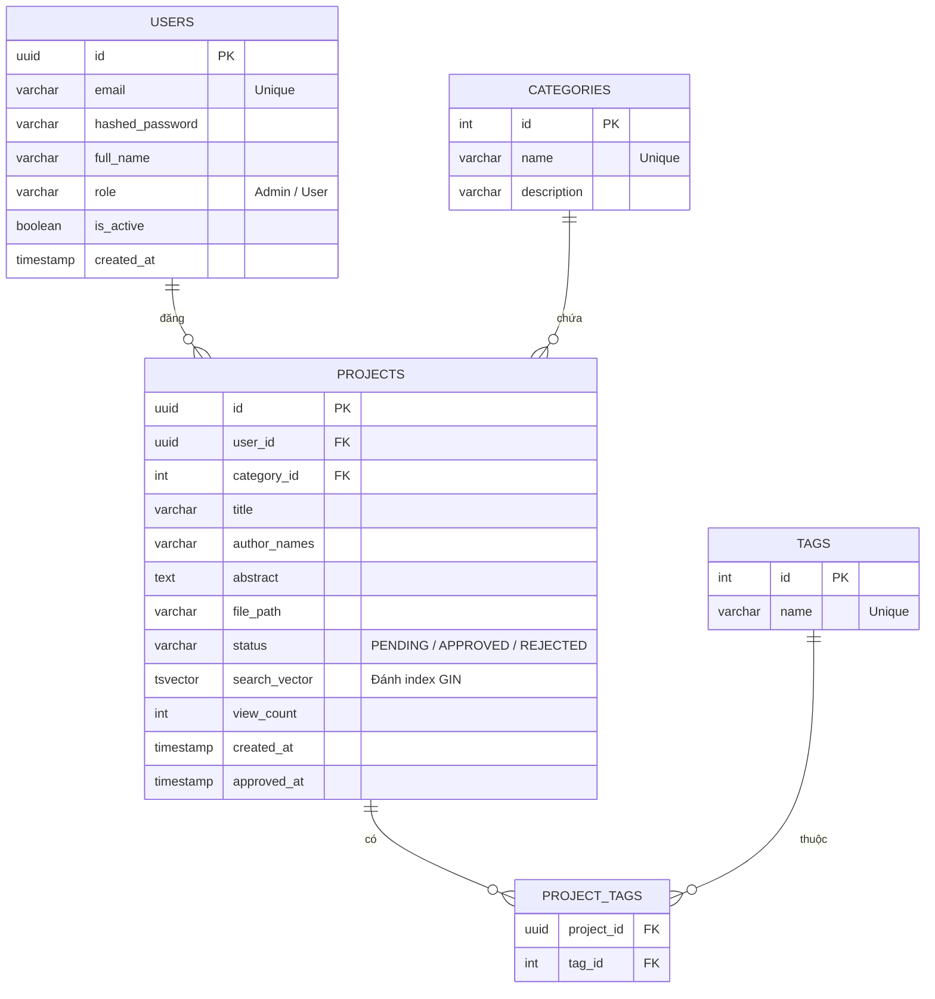

4.4 Thiết kế module chức năng (Functional Module Design)
Các module chức năng được thiết kế sâu ở tầng Application và Infrastructure, đóng gói các logic phức tạp để các module khác gọi đến thông qua Dependency Injection.

- Module Xác thực (Auth Module): Chứa lớp `TokenBlacklistManager` giao tiếp trực tiếp với Redis. Hàm `verify_token()` được thiết kế như một Middleware trong FastAPI, mọi Request đi qua các endpoint bảo mật đều bị chặn lại tại hàm này để giải mã JWT, kiểm tra thời hạn và đối chiếu với danh sách đen.
- Module Tìm kiếm (Search Module): Chứa lớp `FullTextSearchEngine`. Lớp này chịu trách nhiệm nối các bảng (JOIN) và tự động sinh câu lệnh SQL `to_tsquery('english', keyword)` khi người dùng tìm kiếm. Module này cũng chịu trách nhiệm xử lý logic Phân trang (Offset/Limit) để không tải toàn bộ dữ liệu lên RAM cùng lúc.
- Module Lưu trữ (Storage Module): Thiết kế theo pattern Interface (`IStorageProvider`). Mặc định sử dụng `LocalFileSystemStorage` lưu file PDF vào thư mục `/uploads`. Thiết kế này giúp hệ thống sẵn sàng cắm thêm `S3StorageProvider` (lưu trên AWS S3) trong tương lai mà không phải sửa lại code ở các tầng khác.

---

4.5 Thiết kế Cơ sở dữ liệu (Database Design)
Cơ sở dữ liệu là trái tim của hệ thống. VNU Research Repository sử dụng PostgreSQL - một hệ quản trị CSDL quan hệ siêu phàm, vừa đảm bảo tính toàn vẹn dữ liệu (ACID) cực tốt, vừa hỗ trợ khả năng tìm kiếm văn bản phức tạp mà không cần phải cài thêm hệ thống phụ (như Elasticsearch).

4.5.1 Sơ đồ thực thể liên kết (ERD - Entity Relationship Diagram)

Sơ đồ dưới đây minh họa các thực thể chính, khóa chính (PK), khóa ngoại (FK) và mối quan hệ giữa chúng (1-N, N-N).

4.5.2 Từ điển dữ liệu (Data Dictionary)
Bảng từ điển dữ liệu cung cấp đặc tả kỹ thuật chi tiết nhất cho từng cột trong cơ sở dữ liệu vật lý.

**Bảng 1: Bảng `users` (Quản lý tài khoản người dùng)**
Bảng này lưu trữ thông tin định danh và quyền hạn của tất cả người dùng trong hệ thống.
| Tên cột | Kiểu dữ liệu | Độ dài | Khóa / Ràng buộc | Ý nghĩa / Giải thích |
|---|---|---|---|---|
| `id` | UUID | 36 | Primary Key | Mã định danh duy nhất (sử dụng UUID v4 chống dò đoán). |
| `email` | VARCHAR | 150 | Unique, Not Null | Email đăng nhập, chỉ chấp nhận định dạng chuẩn. |
| `hashed_password` | VARCHAR | 255 | Not Null | Mật khẩu đã được mã hóa bằng thuật toán bcrypt. |
| `full_name` | VARCHAR | 100 | Not Null | Họ và tên đầy đủ của người dùng. |
| `role` | VARCHAR | 20 | Default 'User' | Quyền hạn của tài khoản (nhận giá trị 'Admin' hoặc 'User'). |
| `is_active` | BOOLEAN | 1 | Default TRUE | Cờ trạng thái: TRUE (hoạt động), FALSE (Bị khóa/Ban). |
| `created_at` | TIMESTAMP | - | Default NOW() | Thời điểm tạo tài khoản. |
| `updated_at` | TIMESTAMP | - | Default NOW() | Thời điểm cập nhật thông tin lần cuối. |

**Bảng 2: Bảng `categories` (Danh mục Lĩnh vực nghiên cứu)**
Phân loại các đề tài thành các nhóm lĩnh vực lớn (Ví dụ: CNTT, Kinh tế, Ngoại ngữ).
| Tên cột | Kiểu dữ liệu | Độ dài | Khóa / Ràng buộc | Ý nghĩa / Giải thích |
|---|---|---|---|---|
| `id` | SERIAL (INT) | - | Primary Key | ID tự tăng. Dùng INT thay vì UUID để tối ưu tốc độ Filter. |
| `name` | VARCHAR | 100 | Unique, Not Null | Tên lĩnh vực (Ví dụ: "Khoa học Máy tính"). |
| `description` | TEXT | - | Nullable | Mô tả chi tiết về lĩnh vực này. |

**Bảng 3: Bảng `projects` (Lưu trữ Đề tài NCKH)**
Bảng cốt lõi của hệ thống, chứa siêu dữ liệu và trạng thái của các tài liệu.
| Tên cột | Kiểu dữ liệu | Độ dài | Khóa / Ràng buộc | Ý nghĩa / Giải thích |
|---|---|---|---|---|
| `id` | UUID | 36 | Primary Key | Mã định danh duy nhất của đề tài. |
| `user_id` | UUID | 36 | Foreign Key | Liên kết với bảng `users`, xác định ai là người nộp. |
| `category_id` | INT | - | Foreign Key | Liên kết với bảng `categories`. |
| `title` | VARCHAR | 255 | Not Null | Tiêu đề chính thức của đề tài nghiên cứu. |
| `author_names` | VARCHAR | 255 | Not Null | Tên các tác giả tham gia (Dạng chuỗi phân cách bởi dấu phẩy). |
| `abstract` | TEXT | - | Nullable | Tóm tắt nội dung đề tài. Phục vụ việc xem trước (Preview). |
| `file_path` | VARCHAR | 500 | Not Null | Đường dẫn lưu trữ vật lý của file PDF trên Server/S3. |
| `status` | VARCHAR | 20 | Default 'PENDING'| Trạng thái: 'PENDING' (Chờ duyệt), 'APPROVED' (Đã duyệt), 'REJECTED' (Từ chối). |
| `search_vector` | TSVECTOR | - | - | Cột đặc biệt, chứa tập hợp các từ vị được phân tích từ `title` và `abstract` để phục vụ Full-Text Search. |
| `view_count` | INT | - | Default 0 | Số lượt xem chi tiết đề tài. Phục vụ tính năng Trending. |
| `created_at` | TIMESTAMP | - | Default NOW() | Thời điểm nộp đề tài. |
| `approved_at` | TIMESTAMP | - | Nullable | Thời điểm được Admin duyệt (dùng để lọc danh sách mới nhất). |

**Bảng 4: Bảng `tags` (Từ khóa)**
Hệ thống sử dụng Tags để gắn nhãn linh hoạt cho các đề tài.
| Tên cột | Kiểu dữ liệu | Độ dài | Khóa / Ràng buộc | Ý nghĩa / Giải thích |
|---|---|---|---|---|
| `id` | SERIAL (INT) | - | Primary Key | ID tự tăng. |
| `name` | VARCHAR | 50 | Unique, Not Null | Tên nhãn (Ví dụ: "AI", "Blockchain", "Kinh tế vi mô"). |

**Bảng 5: Bảng `project_tags` (Bảng trung gian N-N)**
Do một đề tài có nhiều tag, và một tag nằm ở nhiều đề tài, bảng này dùng để giải quyết quan hệ nhiều-nhiều (N-N).
| Tên cột | Kiểu dữ liệu | Độ dài | Khóa / Ràng buộc | Ý nghĩa / Giải thích |
|---|---|---|---|---|
| `project_id` | UUID | 36 | PK, FK | Liên kết với bảng `projects`. Cùng với `tag_id` tạo thành Khóa chính kép. |
| `tag_id` | INT | - | PK, FK | Liên kết với bảng `tags`. |

4.5.3 Thiết kế Chỉ mục (Indexing Strategy)
Để đạt được hiệu năng truy xuất <100ms, việc đánh index (lập mục lục) cho DB là bắt buộc. Hệ thống áp dụng 2 loại chỉ mục chuyên biệt:

1. B-Tree Index (Mặc định):
- Đánh tự động trên tất cả các cột khóa chính (PK) và khóa ngoại (FK) như `user_id`, `category_id`.
- Đánh chủ động trên các cột thường xuyên dùng để lọc (WHERE) và sắp xếp (ORDER BY): `projects.status` (giúp Admin lọc bài chờ duyệt nhanh), `projects.approved_at` (giúp User lọc bài mới nhất).

2. GIN Index (Generalized Inverted Index):
Đây là bí mật hiệu năng của hệ thống. Không thể dùng B-Tree cho tìm kiếm văn bản vì B-Tree chỉ tốt cho so sánh bằng (=) hoặc lớn nhỏ (< >).
- Hệ thống áp dụng GIN Index lên cột `search_vector` của bảng `projects`. Khi có GIN, thay vì quét qua hàng chục vạn dòng văn bản, Postgres chỉ cần tìm trong "Từ điển chỉ mục ngược" xem từ khóa đó xuất hiện ở những dòng ID nào, sau đó bốc thẳng các dòng ID đó ra. Giúp giảm độ phức tạp từ O(N) xuống mức O(log N).
- Kết hợp với Extension `pg_trgm` (Trigram): Đánh index GIN dạng Trigram lên cột `title`. Kỹ thuật này chia từ thành các cụm 3 ký tự liên tiếp (Ví dụ: "AI" -> " AI", "AI "). Khi người dùng gõ sai chính tả (ví dụ gõ "ia"), hệ thống sẽ tính điểm tương đồng (Similarity Score) giữa các chuỗi Trigram để trả về kết quả mờ (Fuzzy Search) cực kỳ hiệu quả.
