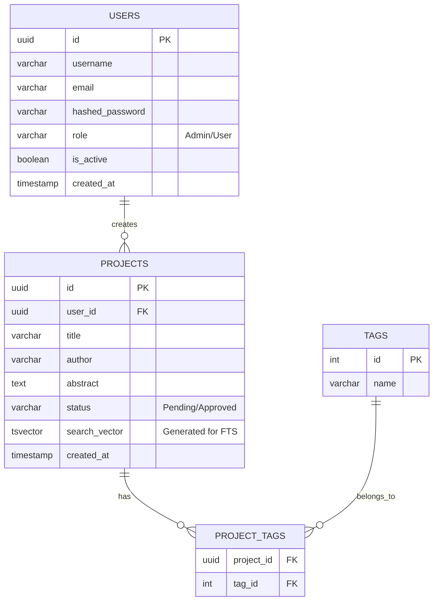
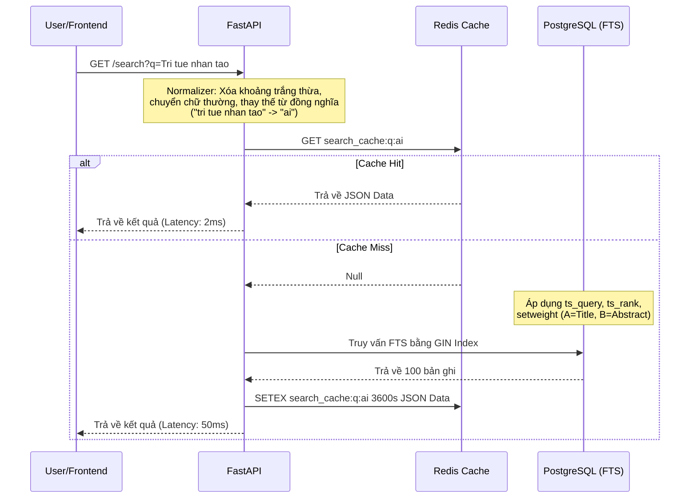
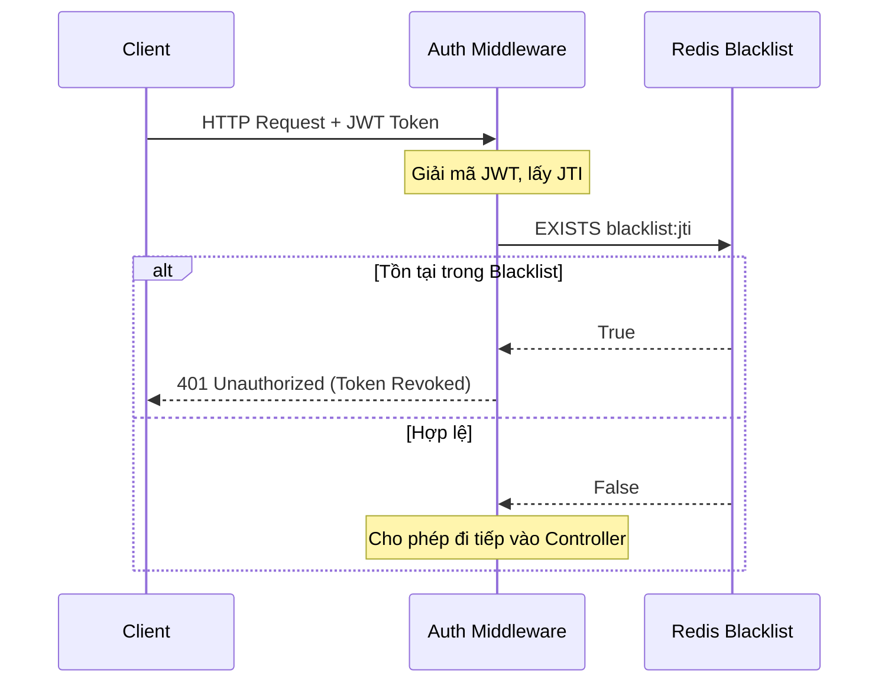

# BÁO CÁO PHÂN TÍCH VÀ THIẾT KẾ HỆ THỐNG CHUYÊN SÂU
**Dự án: VNU Research Repository (Enterprise Edition)**

---

## CHƯƠNG 1. TỔNG QUAN VÀ BỐI CẢNH DỰ ÁN

### 1.1. Bối cảnh thực tế và vấn đề hiện tại
Trong kỷ nguyên số hóa, số lượng đề tài nghiên cứu khoa học (NCKH), luận văn, luận án và các bài báo khoa học tại các trường đại học (như VNU) ngày càng gia tăng theo cấp số nhân. Tuy nhiên, việc quản lý và tra cứu các tài liệu này hiện đang vấp phải nhiều rào cản:
- **Phân tán dữ liệu:** Dữ liệu lưu trữ rải rác ở nhiều khoa, viện, không có một kho lưu trữ tập trung (Centralized Repository).
- **Hạn chế trong tìm kiếm:** Các hệ thống cũ thường sử dụng các câu lệnh truy vấn SQL cơ bản như `LIKE '%keyword%'`. Điều này dẫn đến tốc độ truy vấn cực kỳ chậm (O(N) - quét toàn bảng) khi dữ liệu phình to. Hơn nữa, nó không hỗ trợ tìm kiếm linh hoạt (không nhận diện được lỗi gõ sai, thiếu dấu, hoặc từ đồng nghĩa).
- **Thiếu khả năng mở rộng (Scalability):** Hệ thống cũ được xây dựng theo kiến trúc Monolith nguyên khối truyền thống, không thể chịu được tải lượng lớn (High Traffic) trong các dịp cao điểm như mùa bảo vệ luận văn.
- **Bảo mật lỏng lẻo:** Thiếu cơ chế phân quyền chi tiết (RBAC) và quản lý phiên làm việc chặt chẽ (Session Management), dễ bị tấn công vét cạn (Brute-force) hoặc lạm dụng tài nguyên (DDoS).

### 1.2. Mục tiêu của dự án (Enterprise Edition)
Dự án "VNU Research Repository" được sinh ra để giải quyết triệt để các vấn đề trên, với mục tiêu nâng cấp từ một nguyên mẫu (Prototype) thành một hệ thống chuẩn doanh nghiệp (Enterprise Production).
- **Mục tiêu Nghiệp vụ:** Xây dựng một cổng thông tin duy nhất, thân thiện, tốc độ cao giúp sinh viên, giảng viên và nhà nghiên cứu dễ dàng tiếp cận kho tri thức.
- **Mục tiêu Kỹ thuật:** Đạt tốc độ truy vấn tìm kiếm dưới 100ms cho hàng triệu bản ghi; đảm bảo hệ thống có thể scale horizontally (mở rộng theo chiều ngang); thiết lập cơ chế giám sát sức khỏe (Observability) 24/7.

### 1.3. Phạm vi dự án
Hệ thống bao gồm các phân hệ chính:
1. Cổng tra cứu dành cho người dùng cuối (Sinh viên, Giảng viên).
2. Trang quản trị (Admin Dashboard) để quản lý vòng đời của đề tài NCKH.
3. Hệ thống API Backend giao tiếp với các client.
4. Cơ sở hạ tầng lưu trữ và caching tối ưu.

---

## CHƯƠNG 2. PHÂN TÍCH YÊU CẦU HỆ THỐNG

### 2.1. Yêu cầu chức năng (Functional Requirements)

Yêu cầu chức năng định nghĩa những gì hệ thống *phải làm*. Chúng được chia thành các nhóm (Use Case) dựa trên tác nhân (Actor).

#### 2.1.1. Nhóm người dùng khách (Guest / Unauthenticated)
- **UC01 - Tìm kiếm cơ bản:** Khách có thể nhập từ khóa để tìm kiếm các đề tài đã được công bố (Public).
- **UC02 - Lọc dữ liệu (Filtering):** Lọc kết quả tìm kiếm theo năm, lĩnh vực, khoa, hoặc loại hình nghiên cứu.
- **UC03 - Xem chi tiết:** Xem tóm tắt (Abstract) và thông tin siêu dữ liệu (Metadata) của đề tài. (Không được phép tải toàn văn).

#### 2.1.2. Nhóm người dùng đã xác thực (Sinh viên / Giảng viên)
- **UC04 - Đăng nhập/Đăng xuất:** Xác thực bằng tài khoản do nhà trường cấp.
- **UC05 - Xem toàn văn:** Được phép xem và tải về bản đầy đủ (Full-text PDF) của đề tài.
- **UC06 - Đề xuất đề tài mới:** Sinh viên/Giảng viên có thể nộp đề cương/đề tài mới lên hệ thống chờ phê duyệt.
- **UC07 - Lưu trữ yêu thích:** Đánh dấu (Bookmark) các đề tài quan tâm để xem lại sau.

#### 2.1.3. Nhóm quản trị viên (Administrator / Moderator)
- **UC08 - Quản lý người dùng:** Thêm, sửa, xóa, khóa (ban) tài khoản người dùng, phân quyền chi tiết.
- **UC09 - Phê duyệt đề tài (Workflow):** Đọc, nhận xét, và chuyển trạng thái đề tài (Pending -> Approved / Rejected).
- **UC10 - Quản lý danh mục:** Quản lý các từ khóa (Tags), Lĩnh vực (Categories), Từ đồng nghĩa (Synonyms dictionary).
- **UC11 - Xem báo cáo thống kê:** Xem biểu đồ lượng truy cập, các từ khóa được tìm kiếm nhiều nhất (Top trending searches).

### 2.2. Yêu cầu phi chức năng (Non-Functional Requirements)

Yêu cầu phi chức năng quyết định *chất lượng* của hệ thống.

- **Hiệu năng (Performance & Responsiveness):**
  - Thời gian phản hồi cho API tìm kiếm (Search Latency) phải < 100ms ở phân vị 95 (P95) với tải 1000 RPS.
  - Các API CRUD thông thường phải < 50ms.
- **Độ tin cậy và Khả dụng (Reliability & Availability):**
  - Đạt mức khả dụng 99.9% (Uptime).
  - Có cơ chế tự động khôi phục (Auto-healing) khi một dịch vụ bị crash (thông qua Docker/Kubernetes healthchecks).
- **Khả năng mở rộng (Scalability):**
  - Hệ thống Backend (FastAPI) phải là dạng phi trạng thái (Stateless) để dễ dàng tăng số lượng Container khi có Load Balancer đứng trước.
  - Session và Cache phải được lưu trữ tập trung tại Redis.
- **Bảo mật (Security):**
  - Mọi giao tiếp qua mạng phải được mã hóa bằng TLS/SSL.
  - Tránh triệt để các lỗ hổng OWASP Top 10 (SQL Injection, XSS, CSRF).
  - Mật khẩu lưu trong DB phải được băm (Hash) bằng thuật toán bcrypt.

---

## CHƯƠNG 3. THIẾT KẾ KIẾN TRÚC HỆ THỐNG

### 3.1. Sơ đồ Kiến trúc Tổng thể (High-Level Architecture)

Hệ thống được thiết kế theo hướng dịch vụ (Service-Oriented Architecture - SOA) kết hợp đóng gói Container, làm tiền đề cho Microservices.

```mermaid
graph TD
    %% Định nghĩa các node
    Client_Web[Web Browser (React/Vite)]
    Client_Mob[Mobile App]
    WAF[Web Application Firewall / Nginx LB]
    
    subgraph K8S_Docker_Cluster [Môi trường Container hóa]
        API_Gateway[FastAPI - API Gateway / Main Backend]
        Auth_Service[Auth Module]
        Search_Service[Search Module]
        Metrics_Exporter[Prometheus Exporter]
    end
    
    subgraph Data_Layer [Tầng Dữ Liệu]
        PostgreSQL[(PostgreSQL - Primary DB)]
        Redis_Cache[(Redis - Distributed Cache)]
    end
    
    subgraph Observability_Layer [Tầng Giám Sát]
        Prometheus[Prometheus Server]
        Grafana[Grafana Dashboards]
    end

    %% Flow dữ liệu
    Client_Web -->|HTTPS / REST| WAF
    Client_Mob -->|HTTPS / REST| WAF
    
    WAF -->|Load Balancing| API_Gateway
    
    API_Gateway --- Auth_Service
    API_Gateway --- Search_Service
    API_Gateway --- Metrics_Exporter
    
    Auth_Service -->|Check/Set Token Blacklist| Redis_Cache
    Auth_Service -->|Verify User| PostgreSQL
    
    Search_Service -->|Check Cache (Hit/Miss)| Redis_Cache
    Search_Service -->|Query FTS| PostgreSQL
    
    Metrics_Exporter -->|Expose /metrics| Prometheus
    Prometheus -->|Data Source| Grafana
```

### 3.2. Lựa chọn Công nghệ (Technology Stack Justification)

1. **Frontend: ReactJS + Vite + TypeScript**
   - *Lý do:* React có hệ sinh thái phong phú, kết hợp Vite mang lại tốc độ build siêu tốc. TypeScript đảm bảo an toàn kiểu dữ liệu (type-safe), giảm thiểu tối đa các lỗi runtime.
2. **Backend: Python + FastAPI**
   - *Lý do:* FastAPI sử dụng cơ chế xử lý bất đồng bộ (Asynchronous - `async/await`) với `uvloop`, cung cấp hiệu năng ngang ngửa NodeJS/Go trong khi vẫn tận dụng được hệ sinh thái xử lý dữ liệu mạnh mẽ của Python. Hỗ trợ tự động sinh tài liệu Swagger UI (OpenAPI).
3. **Database: PostgreSQL**
   - *Lý do:* Không chỉ là RDBMS mạnh nhất, PostgreSQL cung cấp sẵn module Full-Text Search (kiểu `TSVECTOR`) và extension `pg_trgm` rất mạnh mẽ, loại bỏ nhu cầu phải vận hành một hệ thống trung gian cồng kềnh như Elasticsearch cho dự án quy mô vừa và lớn, giúp giảm chi phí hạ tầng.
4. **Cache & Session Store: Redis**
   - *Lý do:* Redis là in-memory data store có tốc độ đọc ghi tính bằng microsecond. Hỗ trợ TTL (Time-To-Live) tự động xóa dữ liệu cũ, cực kỳ phù hợp cho Rate Limiting và Token Blacklist.
5. **Observability: Prometheus + Grafana**
   - *Lý do:* Bộ đôi tiêu chuẩn công nghiệp cho Cloud-native. Prometheus thu thập metrics dạng Time-series, Grafana giúp vẽ biểu đồ trực quan.

---

## CHƯƠNG 4. THIẾT KẾ CƠ SỞ DỮ LIỆU (DATABASE DESIGN)

### 4.1. Sơ đồ Quan hệ Thực thể (ERD)



### 4.2. Chi tiết bảng và Tối ưu hóa (Indexing Strategy)

Để đảm bảo hiệu năng hàng triệu bản ghi, việc thiết kế Index là yếu tố sống còn.

#### Bảng `projects` (Trọng tâm)
Đây là bảng phình to nhanh nhất và chịu nhiều lượt truy vấn nhất.

**Column `search_vector`:**
Đây là cột đặc biệt (Generated Column). Bất cứ khi nào `title`, `author`, hoặc `abstract` được INSERT/UPDATE, PostgreSQL sẽ tự động tính toán lại cột này.
*Cơ chế:* Cột này sẽ đi qua một hàm phân tích từ vựng (Lexer/Stemmer) để loại bỏ các từ vô nghĩa (Stopwords) và đưa từ về gốc (ví dụ: "running" -> "run").

**Chiến lược Index:**
1. **B-Tree Index:** Áp dụng trên cột `status` và `created_at` để lọc dữ liệu nhanh.
   `CREATE INDEX idx_projects_status ON projects(status);`
2. **GIN Index (Generalized Inverted Index):** Áp dụng trên cột `search_vector`. GIN ánh xạ mỗi từ khóa (lexeme) đến danh sách các hàng chứa nó (Inverted Index). Tốc độ tìm kiếm giảm từ O(N) xuống O(log N).
   `CREATE INDEX idx_projects_search ON projects USING GIN(search_vector);`
3. **Trigram Index (GIST/GIN):** Hỗ trợ tìm kiếm mờ (Fuzzy) cho các trường hợp gõ sai chính tả.
   `CREATE INDEX idx_projects_title_trgm ON projects USING GIN(title gin_trgm_ops);`

---

## CHƯƠNG 5. THIẾT KẾ CHI TIẾT CÁC PHÂN HỆ CỐT LÕI

Phần này đi sâu vào cách giải quyết các bài toán kỹ thuật khó bằng các mẫu thiết kế (Design Patterns).

### 5.1. Phân hệ Tra Cứu Nâng Cao (Advanced Search Engine)

**Vấn đề:** Câu lệnh `LIKE '%...%'` khiến Database bị thắt cổ chai (Bottleneck).
**Giải pháp:** Áp dụng luồng xử lý Search Engine ngay trong DB.

#### 5.1.1. Luồng xử lý tìm kiếm (Search Flow)



#### 5.1.2. Thuật toán Xếp hạng (Ranking Algorithm)
Để kết quả trả ra chính xác với ý định của người dùng, hệ thống đánh trọng số các trường:
- Tiêu đề (Title): Trọng số A (Cao nhất).
- Tác giả (Author): Trọng số B.
- Tóm tắt (Abstract): Trọng số C.
- Kết quả cuối cùng được sắp xếp theo hàm `ts_rank()` của DB.

### 5.2. Chiến Lược Bộ Đệm (Cache Strategy & Invalidation)

Hệ thống tuân thủ mô hình **Cache-Aside Pattern**.

**Bài toán Nhất quán dữ liệu (Data Consistency):**
Nếu Admin sửa tiêu đề một đề tài, nhưng bộ đệm Redis vẫn lưu dữ liệu cũ trong 1 tiếng, người dùng sẽ thấy thông tin sai lệch.

**Giải pháp (Event-driven Cache Invalidation):**
Khi có sự kiện đột biến (Mutate: Create, Update, Delete) trên bảng `projects`:
1. Giao dịch (Transaction) commit thành công vào DB.
2. FastAPI đẩy một `Background Task`.
3. Task này kết nối vào Redis, sử dụng lệnh `SCAN` để tìm tất cả các keys có tiền tố `search_cache:*` và `DEL` (xóa) chúng.
4. Lần tìm kiếm tiếp theo của người dùng sẽ bị Cache Miss và buộc DB phải lấy dữ liệu mới nhất lên, đồng thời nạp lại vào Cache.

### 5.3. Phân hệ Bảo mật và Xác thực (Enterprise Security Auth)

Sử dụng cơ chế Dual-Token (JWT) kết hợp Stateful Blacklist để tối đa hóa tính bảo mật.

#### 5.3.1. Vòng đời Token (Token Lifecycle)

- **Access Token:** Có tuổi thọ rất ngắn (15-30 phút). Được client gửi trong Header `Authorization: Bearer <token>` mỗi lần gọi API. Nếu bị lộ, hacker chỉ có thể sử dụng trong thời gian ngắn.
- **Refresh Token:** Tuổi thọ dài (7-30 ngày). Chỉ dùng để gọi API `/refresh` lấy Access Token mới khi cái cũ hết hạn. Bị lưu vào HTTPOnly Cookie để chống lỗi XSS.

#### 5.3.2. Cơ chế thu hồi quyền (Logout / Revocation)
Vấn đề của JWT (Stateless) là không thể xóa token từ server trước khi nó hết hạn.
- **Giải pháp:** Khi người dùng ấn Logout, Frontend gửi API Logout. Backend trích xuất mã định danh `jti` (JWT ID) từ token, và thêm vào **Redis Blacklist** với thời gian sống (TTL) bằng chính thời gian sống còn lại của token đó.
- Bất kỳ API nào yêu cầu xác thực, Middleware đều kiểm tra `jti` trong Redis. Nếu tồn tại -> Từ chối truy cập (HTTP 401).



#### 5.3.3. Giới hạn truy cập thông minh (Smart Rate Limiting)
Bảo vệ DB khỏi việc bị cào dữ liệu (Crawling) hoặc tấn công DDoS:
- Hệ thống áp dụng thuật toán **Token Bucket** qua Redis.
- Nếu request có JWT: Dùng `user_id` làm Key giới hạn (Ví dụ: 100 requests/phút).
- Nếu request khách (Guest): Lấy `Hash(IP + User-Agent)` làm Key. Điều này giúp phân biệt các thiết bị khác nhau đằng sau cùng một Modem Wifi (NAT).

### 5.4. Phân hệ Vận hành và Giám sát (DevOps & Observability)

Một hệ thống Enterprise không thể chạy "mù". Mọi hoạt động phải được quan sát (Observable).

#### 5.4.1. Thu thập Metrics (Prometheus)
FastAPI được tích hợp thư viện `prometheus-fastapi-instrumentator`. Nó tự động chặn (intercept) mọi Request/Response và ghi lại:
- **HTTP_REQUESTS_TOTAL:** Tổng số lượng request.
- **HTTP_REQUEST_DURATION_SECONDS:** Biểu đồ histogram đo lường thời gian trễ (Latency). Cho biết bao nhiêu % request được xử lý dưới 50ms, 100ms.

#### 5.4.2. Business Analytics (Grafana)
Grafana được cấu hình để không chỉ hiển thị mức tiêu thụ CPU/RAM, mà còn trả lời các câu hỏi nghiệp vụ:
- *Lưu lượng tìm kiếm hôm nay là bao nhiêu?*
- *Từ khóa nào bị "Zero-result" (Người dùng tìm nhưng không có dữ liệu)?* -> Từ đó quản trị viên có thể thêm dữ liệu hoặc thêm từ đồng nghĩa vào từ điển.

#### 5.4.3. Docker Auto-healing (Khôi phục tự động)
Trong file cấu hình `docker-compose.yml`, mỗi service đều định nghĩa khối `healthcheck`.
- Docker Daemon sẽ tự động gọi `curl -f http://localhost:8000/health` mỗi 30 giây.
- Nếu Backend bị treo (Deadlock) và không trả lời 3 lần liên tiếp, Docker sẽ tự động **KILL** và **RESTART** container đó, đảm bảo tính Khả dụng cao (High Availability).

---

## CHƯƠNG 6. TỔNG KẾT VÀ ĐỊNH HƯỚNG TƯƠNG LAI

### 6.1. Đánh giá kết quả đạt được
Qua 4 giai đoạn tái cấu trúc, dự án **VNU Research Repository (Enterprise Edition)** đã lột xác thành công. Nó vượt qua giới hạn của một ứng dụng CRUD đơn thuần để trở thành một hệ thống phân tán, chịu tải cao, và sở hữu các lõi kỹ thuật tiên tiến (Advanced FTS, Distributed Caching, Dual-Token Auth).

Thiết kế của hệ thống thể hiện rõ triết lý "Làm đúng từ đầu" (Doing it right the first time), chú trọng vào cả bảo mật, tốc độ, và khả năng giám sát.

### 6.2. Hướng phát triển trong tương lai
Với nền tảng vững chắc hiện tại, hệ thống sẵn sàng để mở rộng thêm các tính năng nâng cao:
1. **AI / Machine Learning Integration:** Tích hợp mô hình NLP (Natural Language Processing) như BERT để đề xuất các bài báo liên quan (Recommendation System) dựa trên nội dung đọc của người dùng, thay vì chỉ tìm kiếm theo từ khóa.
2. **Elasticsearch / OpenSearch Migration:** Nếu dữ liệu tăng lên quy mô hàng chục triệu bản ghi vượt quá khả năng của PostgreSQL FTS, hệ thống dễ dàng cấu hình đồng bộ hóa dữ liệu (CDC) sang cụm Elasticsearch chuyên dụng nhờ kiến trúc rời rạc.
3. **Triển khai Kubernetes (K8S):** Đóng gói toàn bộ cụm Docker Compose hiện tại thành các file Helm Chart để triển khai lên Cloud (AWS/Google Cloud), đạt khả năng Auto-scaling (tự động tăng giảm số lượng server theo tải).
